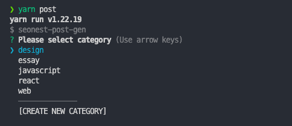

# blog.seonest.net-post-gen

Post gen for blog.seonest.net

## ⚠️ Caution

This only can run in ESM module. because this use `chalk` library.

## Install

**npm**

```bash
npm install -D seonest-post-gen
```

**yarn**

```bash
yarn add -D seonest-post-gen
```

## Usage

**package.json**

```json
{
  "scripts": {
    "post": "seonest-post-gen"
  }
}
```

**CLI**

```bash
# npm
npm run seonest-post-gen

# yarn
yarn seonest-post-gen
```

**options**

```bash
# npm
npm run seonest-post-gen --help

# yarn
yarn seonest-post-gen --help
```


